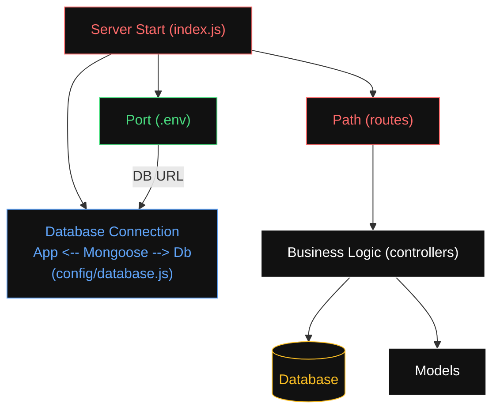

# # What is Middleware ???

# # What is Routes ??



# # How to connect Express and MongoDB ??

- We can connect Express and MongoDB by Mongoose
- Install Mongoose by CMD --> `npm install mongoose`

``` js
const mongoose = require('mongoose');
mongoose.connect('mongodb://localhost:27017/carsDB', {useNewUrlParser: true, useUnifiedTopology: true})

    .then(() => console.log('MongoDB connected'))
    .catch(err => console.log(err));
``` 
