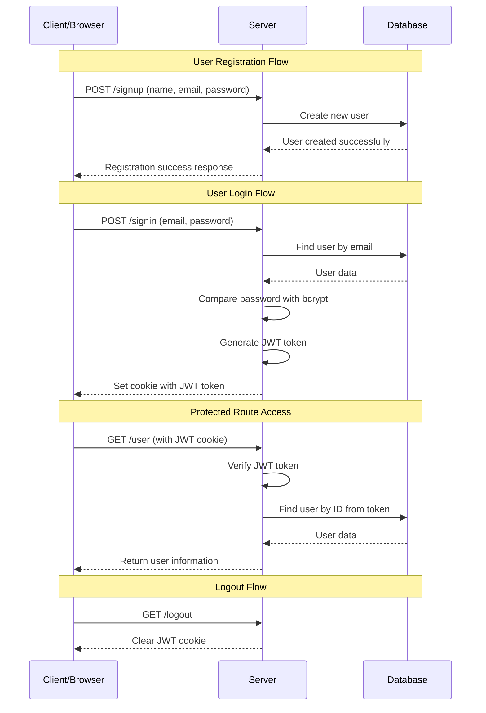

# # Authentication and Authorization

# # What is Authentication ??

-  It the process of verifying the identity of a user or system to ensure they are who they claim to be.
-  It needs usually the user's login details.
-  **`Purpose`** --> To confirm the user's identity and prevent unauthorized access.
-  **`Process`** --> Compares users credentials with stored data.
-  **`Method`** --> Username/Password, OTP, Security question


# # What is Authorization ??
- It is the process of determining and granting access rights to an authenticated user or system.
- It defines what resources a user can access and what actions they are allowed to perform.
-  **`Purpose`** --> To ensure users can only access resources they are allowed to.
-  **`Process`** --> Grant or denies access based on roles/permissions.
-  **`Method`** --> Role-Based Access Control (RBAC) permissions


## Secure Authentication Flow :


## System Architecture


# # JSON Web Token (JWT) 

**JWT Documentation** ---> https://www.jwt.io/

- It is a secure way to send information between a client and a server.
- It is mainly used in web applications and APIs to verify users and prevent unauthorized access.
-  A JWT is JSON data secured with a cryptographic signature.
-  The signing can be done using these cryptographic methods:
   - `HMAC` (Hash-based Message Authentication Code)
   - `RSA` or `ECDSA` (Asymmetric cryptographic algorithms)

## JWT Structure

A JWT consists of three parts, separated by dots
- `Header` : Contains metadata about the token, such as the algorithm used for signing.
- `Payload` : Stores the claims, i.e., data being transmitted.
- `Signature` : Ensures the token's integrity and authenticity.


## JWT Token Generation

``` js
// Import
const jwt = require("jsonwebtoken");

// Verify password & generate a JWT token

        const payload = {
            email : user.email,
            id : user._id,
            role : user.role,
        };


        if(await bcrypt.compare(password,user.password)){
            // password match or JWT Token Generation
            let token = jwt.sign(payload,process.env.JWT_SECRET,{
                expiresIn : "2h",
            });

            user = user.toObject();
            user.token = token;
            user.password = undefined;

            const options = {
                expires : new Date(Date.now() + 3 * 24 * 60 * 60 * 1000),
                httpOnly : true,
            }

            res.cookie("token",token,options).status(200).json({
                success : true,
                token,
                user,
                message:"User logged in successfully"
            });
        }
        else {
            // password not match
            return res.status(403).json({
                success : false,
                message : "Password does not match",
            })
        }

```

# # What is Cookies ??

- Cookies are data, stored in small text files, on your computer.
- When a web server has sent a web page to a browser, the connection is shut down, and the server forgets everything about the user.
- Cookies were invented to solve the problem "how to remember information about the user" :
  - When a user visits a web page, his/her name can be stored in a cookie.
  - Next time the user visits the page, the cookie "remembers" his/her name.


# # What is Bcrypt ??

**Bcrypt Documentation** ---> https://www.npmjs.com/package/bcrypt

- A library to help you hash passwords.
- **`Installation`** ---> npm install bcrypt
- **Syntax** -->

```
hash(data, salt, cb)  
data - [REQUIRED] - the data to be encrypted.  
salt - [REQUIRED] - the salt to be used to hash the password. (No. of Rounds)  
cb - [OPTIONAL] - a callback to be fired once the data has been encrypted.
```

``` js
// Import
const bcrypt = require("bcrypt"):


// Securing Password by Hashing
let hashedPassword = await bcrypt.hash(password, 10);
        try {
            
        } catch (error) {
            return res.status(500).json({
                success : false,
                message : "Error in hashing Password",
            })
        }

```


